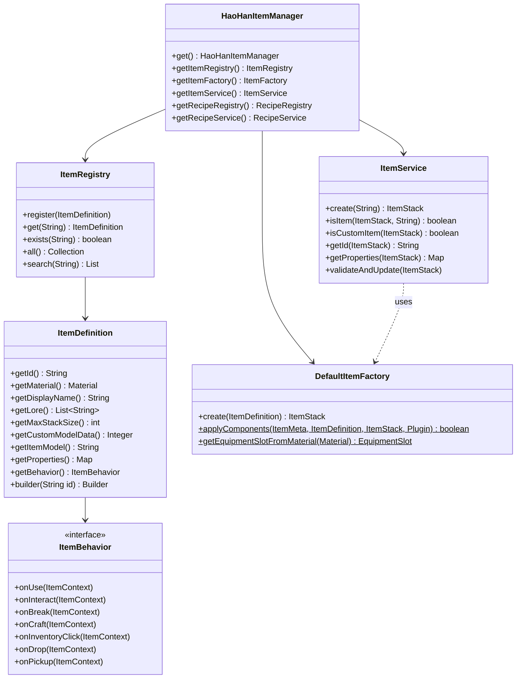

# Hướng dẫn & Tài liệu API: HaoHanItemManager

Tài liệu này cung cấp chi tiết về cấu trúc lớp (class structure), giao diện (interfaces), và các phương thức (methods) trong API của **HaoHanItemManager**. Đây là hệ thống cốt lõi quản lý Custom Items và Custom Recipes cho HaoHan SMP, giúp các plugin vệ tinh dễ dàng tích hợp và mở rộng.

---

## 1. Điểm Khởi Đầu (API Entrypoint)

### Class `HaoHanItemManager`

Là lớp Singleton chính để truy cập tất cả các hệ thống con trong API.

* **Lấy instance:**
  ```java
  HaoHanItemManager api = HaoHanItemManager.get();
  ```
* **Các phương thức:**
  | Kiểu trả về | Tên phương thức | Mô tả |
  | :--- | :--- | :--- |
  | `static HaoHanItemManager` | `get()` | Lấy instance Singleton. Ném `IllegalStateException` nếu plugin chưa load xong. |
  | `ItemRegistry` | `getItemRegistry()` | Registry quản lý `ItemDefinition`. |
  | `ItemFactory` | `getItemFactory()` | Factory tạo `ItemStack` từ định nghĩa. |
  | `ItemService` | `getItemService()` | Facade kết hợp các tính năng Item (khuyến nghị dùng từ plugin ngoài). |
  | `RecipeRegistry` | `getRecipeRegistry()` | Registry quản lý `RecipeDefinition`. |
  | `RecipeService` | `getRecipeService()` | Service tìm kiếm/tra cứu Recipes. |

---

## 2. Hệ Thống Custom Items

### 2.1 Định nghĩa Item (`ItemDefinition` & `ItemType`)

#### Enum `ItemType`
`MATERIAL` · `TOOL` · `WEAPON` · `ARMOR` · `FOOD` · `MACHINE_COMPONENT` · `CURRENCY` · `SPECIAL`

#### Các phương thức trong `ItemDefinition`

| Phương thức | Mô tả |
| :--- | :--- |
| `String getId()` | ID dạng `namespace:key` (ví dụ: `haohan:oxygen_tank`). |
| `String getNamespace()` | Phần namespace (ví dụ: `haohan`). |
| `String getKey()` | Phần key (ví dụ: `oxygen_tank`). |
| `Material getMaterial()` | Material Minecraft gốc. |
| `String getDisplayName()` | Tên hiển thị (hỗ trợ `§`). |
| `int getMaxStackSize()` | Số lượng tối đa 1 stack (1–99). |
| `List<String> getLore()` | Danh sách lore. |
| `Integer getCustomModelData()` | CustomModelData (có thể null). |
| `String getItemModel()` | NamespacedKey dạng string cho item model (có thể null). |
| `Map<String, Object> getProperties()` | Map thuộc tính tùy biến (bao gồm built-in keys). |
| `ItemBehavior getBehavior()` | Đối tượng xử lý hành vi. |
| `boolean hasBehavior()` | Kiểm tra có hành vi tùy biến không. |
| `static boolean isValidId(String id)` | Kiểm tra ID đúng format `namespace:key`. |

#### Builder Pattern cho `ItemDefinition`

```java
ItemDefinition.builder("magic:fire_crystal")
    .material(Material.EMERALD)
    .displayName("§cFire Crystal")
    .maxStackSize(16)
    .lore(List.of("§7A fire crystal."))
    .addLore("§8Tier: 1")
    .customModelData(1001)
    .properties(Map.of("element", "fire"))
    .property("tier", 1)
    .type(ItemType.MATERIAL)
    .behavior(new FireCrystalBehavior())
    .build();
```

**Built-in property keys được xử lý tự động:**

| Property Key | Kiểu | Mô tả |
| :--- | :--- | :--- |
| `max_damage` | `int` | Đặt MaxDamage (độ bền). Item phải là `Damageable`. |
| `jukebox_playable` | `String` NamespacedKey | Gắn `minecraft:jukebox_playable` — đĩa nhạc custom. Ví dụ: `"haohan:my_song"`. |
| `equippable_asset_id` | `String` NamespacedKey | Gắn `minecraft:equippable` với custom armor model. Slot tự xác định theo Material suffix. Ví dụ: `"haohan:spacesuit"`. |
| `custom_block_data` | `String` blockstate | Gắn `minecraft:block_state` cho client dự đoán block state khi đặt (Custom Block system). |

---

### 2.2 Đăng ký Item (`ItemRegistry`)

`ItemRegistry` là "Source of Truth" duy nhất chứa thông tin tất cả Custom Items trên server.

| Kiểu trả về | Tên phương thức | Mô tả |
| :--- | :--- | :--- |
| `void` | `register(ItemDefinition)` | Đăng ký item mới. Lỗi nếu ID trùng hoặc không hợp lệ. |
| `ItemDefinition` | `get(String id)` | Tìm theo ID, `null` nếu không thấy. |
| `ItemDefinition` | `require(String id)` | Tìm theo ID, ném `IllegalArgumentException` nếu không thấy. |
| `boolean` | `exists(String id)` | Kiểm tra ID đã đăng ký chưa. |
| `void` | `unregister(String id)` | Hủy đăng ký item. |
| `Collection<ItemDefinition>` | `all()` | Toàn bộ Custom Items. |
| `List<ItemDefinition>` | `getByNamespace(String ns)` | Items thuộc namespace cụ thể. |
| `List<ItemDefinition>` | `search(String keyword)` | Tìm theo từ khóa trong ID hoặc Display Name. |
| `int` | `size()` | Tổng số items đang đăng ký. |
| `void` | `clear()` | Xóa toàn bộ đăng ký. |

---

### 2.3 Tạo và Quản lý ItemStack (`ItemService` & `ItemFactory`)

> [!TIP]
> Ưu tiên dùng `ItemService` từ plugin ngoài — nó là Facade đơn giản và đầy đủ nhất.

#### Phương thức của `ItemService`

| Kiểu trả về | Phương thức | Mô tả |
| :--- | :--- | :--- |
| `ItemStack` | `create(String id)` | Tạo ItemStack số lượng 1. |
| `ItemStack` | `create(String id, int amount)` | Tạo ItemStack số lượng chỉ định. |
| `boolean` | `isItem(ItemStack, String id)` | Kiểm tra có phải custom item với ID cụ thể. |
| `boolean` | `isCustomItem(ItemStack)` | Kiểm tra có phải custom item bất kỳ. |
| `String` | `getId(ItemStack)` | Lấy Custom Item ID, `null` nếu là vanilla. |
| `ItemDefinition` | `getDefinition(String id)` | Lấy `ItemDefinition` theo ID. |
| `boolean` | `exists(String id)` | Kiểm tra item tồn tại trong registry. |
| `Map<String, Object>` | `getProperties(ItemStack)` | Lấy properties từ definition của item. |
| `void` | `validateAndUpdate(ItemStack)` | Đồng bộ/upgrade components theo definition hiện tại. Bỏ qua item vanilla. |

**`validateAndUpdate()` đồng bộ:**
- Item Model (NamespacedKey theo ID)
- Max Stack Size
- Max Damage (nếu có property `max_damage`)
- Jukebox Playable (nếu có property `jukebox_playable`)
- Equippable Component (nếu có property `equippable_asset_id` và chưa được gắn)

---

### 2.4 Hành vi Custom (`ItemBehavior` & `ItemContext`)

#### Record `ItemContext`

| Field | Kiểu | Mô tả |
| :--- | :--- | :--- |
| `player()` | `Player` | Người chơi thực hiện hành động. |
| `item()` | `ItemStack` | Vật phẩm được tương tác. |
| `definition()` | `ItemDefinition` | Định nghĩa của custom item đó. |
| `event()` | `Event` | Sự kiện Bukkit gốc. |

#### Interface `ItemBehavior` — các method

```java
public interface ItemBehavior {
    default void onUse(ItemContext context) {}         // Right-click AIR/BLOCK
    default void onInteract(ItemContext context) {}    // Left-click
    default void onBreak(ItemContext context) {}       // Phá block
    default void onCraft(ItemContext context) {}       // Craft thành công
    default void onInventoryClick(ItemContext context) {} // Click trong inventory
    default void onDrop(ItemContext context) {}        // Drop item
    default void onPickup(ItemContext context) {}      // Nhặt item
}
```

---

## 3. Hệ Thống Custom Recipes

### 3.1 Cấu trúc Recipe (`RecipeDefinition`, `ShapedRecipeDefinition` & `RecipeType`)

#### Enum `RecipeType`
`SHAPED` · `SHAPELESS` · `SMELTING` · `BLASTING` · `SMOKING` · `CAMPFIRE` · `STONECUTTING` · `SMITHING` · `MACHINE`

> `MACHINE` không đăng ký với Bukkit — plugin con tự xử lý.

#### Class `RecipeDefinition`

| Phương thức | Mô tả |
| :--- | :--- |
| `String getId()` | ID công thức. |
| `RecipeType getType()` | Loại công thức. |
| `List<Ingredient> getIngredients()` | Danh sách nguyên liệu. |
| `ItemResult getResult()` | Kết quả đầu ra. |
| `float getExperience()` | Exp nhận được (khi nung). |
| `int getCookingTime()` | Thời gian nấu, ticks (khi nung). |

#### Class `ShapedRecipeDefinition`

```java
new ShapedRecipeDefinition(
    "magic:mana_crystal",
    List.of(" S ", "SBS", " S "),
    Map.of(
        'S', new Ingredient.ItemIngredient("magic:mana_shard"),
        'B', new Ingredient.ItemIngredient("minecraft:blaze_rod")
    ),
    new ItemResult("magic:mana_crystal", 1)
);
```

---

### 3.2 Nguyên Liệu (`Ingredient`) & Kết Quả (`ItemResult`)

#### Sealed Interface `Ingredient`

1. `Ingredient.ItemIngredient(String id, int amount)` — Custom item hoặc `minecraft:item`.
   - `boolean isVanilla()`: ID bắt đầu bằng `minecraft:`.
2. `Ingredient.MaterialIngredient(Material material, int amount)` — Bukkit Material trực tiếp.
3. `Ingredient.TagIngredient(String tag, int amount)` — Nhóm tag (ví dụ: `#minecraft:planks`).

#### Record `ItemResult`

| Field | Mô tả |
| :--- | :--- |
| `String item()` | ID item đầu ra. |
| `int amount()` | Số lượng tạo ra. |

---

### 3.3 Tra Cứu và Đăng Ký Recipes (`RecipeRegistry` & `RecipeService`)

#### `RecipeRegistry`

| Phương thức | Mô tả |
| :--- | :--- |
| `void register(RecipeDefinition)` | Đăng ký công thức. |
| `RecipeDefinition get(String id)` | Tìm theo ID. |
| `RecipeDefinition require(String id)` | Tìm theo ID, lỗi nếu không thấy. |
| `boolean exists(String id)` | Kiểm tra đã tồn tại chưa. |
| `void unregister(String id)` | Hủy đăng ký. |
| `Collection<RecipeDefinition> all()` | Tất cả công thức. |
| `int size()` | Số lượng đã đăng ký. |
| `void clear()` | Xóa toàn bộ. |

#### `RecipeService`

| Phương thức | Mô tả |
| :--- | :--- |
| `List<RecipeDefinition> findByResult(String itemId)` | Công thức tạo ra item này. |
| `List<RecipeDefinition> findByIngredient(String itemId)` | Công thức sử dụng item này. |
| `List<RecipeDefinition> findByType(RecipeType type)` | Lọc theo loại. |
| `List<RecipeDefinition> search(String keyword)` | Tìm theo từ khóa. |

---

## 4. Hệ thống Tự Động Sanitization

`ItemEventRouter` (internal) tự động gọi `ItemService.validateAndUpdate()` trên các sự kiện:

| Event | Trigger | Priority |
| :--- | :--- | :--- |
| `PlayerJoinEvent` | Toàn bộ inventory + armor slots | LOWEST |
| `InventoryOpenEvent` | Toàn bộ inventory được mở | LOWEST |
| `InventoryClickEvent` | `currentItem` và `cursorItem` | NORMAL |
| `EntityPickupItemEvent` | ItemStack vừa nhặt | LOWEST |
| `PrepareItemCraftEvent` | Item kết quả craft | LOWEST |

Engine bỏ qua item vanilla (không có PersistentData `haohanitemmanager:item_id`).

---

## 5. Hệ thống Custom Block (NoteBlock)

### 5.1 Cơ chế

Engine dùng NoteBlock block state để lưu custom block texture. Khi item có property `custom_block_data`:

1. **`DefaultItemFactory.create()`**: Gắn NMS `BlockItemStateProperties` component vào ItemStack bằng Reflection → client dùng để dự đoán block state khi đặt (không flicker).
2. **`ItemEventRouter.onBlockPlace()` (HIGH)**: Cưỡng bức block state đúng + `sendBlockChange()`.
3. **`ItemEventRouter.onNoteBlockInteract()`**: Schedule 0-tick restore nếu note bị gảy.
4. **`ItemEventRouter.onNoteBlockPhysics()`**: Schedule 0-tick restore nếu physics thay đổi state.

### 5.2 Đăng ký Custom Block

```java
ItemDefinition.builder("haohan:my_ore")
    .material(Material.NOTE_BLOCK)
    .property("custom_block_data", "minecraft:note_block[note=24,instrument=pling,powered=true]")
    .build();
```

---

## 6. Hệ thống Custom Armor Model (Equippable)

### 6.1 Cơ chế (Minecraft 1.21+)

Mô hình giáp khi mặc dùng component `minecraft:equippable` thay vì Custom Model Data.

`DefaultItemFactory.applyComponents()` xử lý property `equippable_asset_id`:
- Xác định `EquipmentSlot` từ Material name suffix.
- Tạo `io.papermc.paper.datacomponent.item.Equippable` với `.assetId(Key.key(assetId))`.
- Gọi `itemStack.setData(DataComponentTypes.EQUIPPABLE, equippable)`.

### 6.2 `DefaultItemFactory.applyComponents()` (static, public)

Phương thức này có thể được gọi từ plugin con để đồng bộ components vào `ItemMeta`/`ItemStack` hiện có:

```java
boolean modified = DefaultItemFactory.applyComponents(meta, definition, itemStack, plugin);
if (modified) {
    itemStack.setItemMeta(meta);
}
```

**Xử lý (theo thứ tự):**
1. Item Model (NamespacedKey)
2. Max Stack Size
3. Max Damage (`max_damage` property)
4. Jukebox Playable (`jukebox_playable` property)
5. Equippable Component (`equippable_asset_id` property)

### 6.3 `DefaultItemFactory.getEquipmentSlotFromMaterial()` (static, public)

Tiện ích xác định `EquipmentSlot` từ `Material`:

```java
EquipmentSlot slot = DefaultItemFactory.getEquipmentSlotFromMaterial(Material.NETHERITE_HELMET);
// → EquipmentSlot.HEAD
```

---

## 7. Ví Dụ Tích Hợp Thực Tế (HaoHanLunar)

### Bước 1: Đăng ký Custom Items

```java
public class LunarItems {

    public static void register() {
        var registry = HaoHanItemManager.get().getItemRegistry();
        var oxygenBehavior = new OxygenTankBehavior();

        // Armor với model 3D custom
        registry.register(ItemDefinition.builder("haohan:spacesuit_helmet")
            .material(Material.NETHERITE_HELMET)
            .displayName("Spacesuit Helmet")
            .customModelData(1001)
            .type(ItemType.ARMOR)
            .property("equippable_asset_id", "haohan:spacesuit")
            .build());

        // Bình oxy với độ bền custom
        registry.register(ItemDefinition.builder("haohan:oxygen_tank_small")
            .material(Material.CARROT_ON_A_STICK)
            .displayName("§bBình Oxy Nhỏ")
            .maxStackSize(1)
            .type(ItemType.SPECIAL)
            .behavior(oxygenBehavior)
            .properties(Map.of(
                "oxygen_tank", true,
                "oxygen_tank_capacity", 1500,
                "max_damage", 1500
            ))
            .build());

        // Custom block qua NoteBlock
        registry.register(ItemDefinition.builder("haohan:anorthosite_ore")
            .material(Material.NOTE_BLOCK)
            .displayName("§7Anorthosite Ore")
            .type(ItemType.SPECIAL)
            .property("custom_block_data",
                "minecraft:note_block[note=24,instrument=pling,powered=true]")
            .build());
    }
}
```

### Bước 2: Kiểm tra Item trong Event Listener

```java
public class OxygenListener implements Listener {

    @EventHandler
    public void onAirChange(EntityAirChangeEvent event) {
        if (!(event.getEntity() instanceof Player player)) return;
        if (!player.getWorld().getName().contains("lunar")) return;

        ItemService items = HaoHanItemManager.get().getItemService();
        ItemStack offhand = player.getInventory().getItemInOffHand();

        // Kiểm tra đang cầm bình oxy
        if (items.isItem(offhand, "haohan:oxygen_tank_small")) {
            // Lấy dung tích từ properties
            Map<String, Object> props = items.getProperties(offhand);
            int capacity = (int) props.getOrDefault("oxygen_tank_capacity", 0);
            // ... logic
        }
    }
}
```

### Bước 3: Upgrade item hiện có thủ công

```java
// Ví dụ: khi player equip armor
@EventHandler
public void onArmorEquip(PlayerArmorChangeEvent event) {
    ItemStack newArmor = event.getNewItem();
    if (newArmor != null) {
        HaoHanItemManager.get().getItemService().validateAndUpdate(newArmor);
    }
}
```

---

## 8. Tóm tắt Class Diagram


